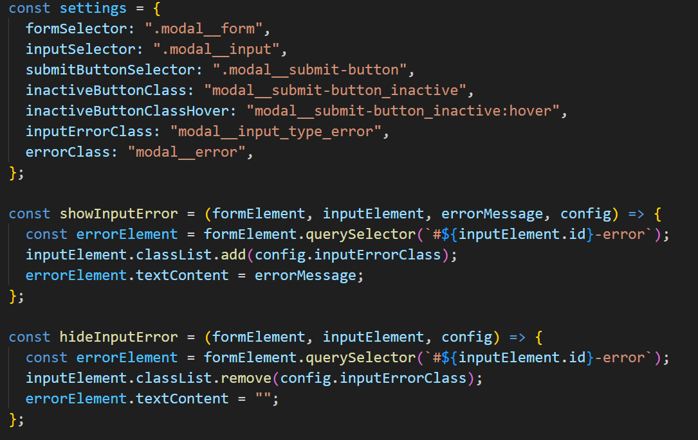
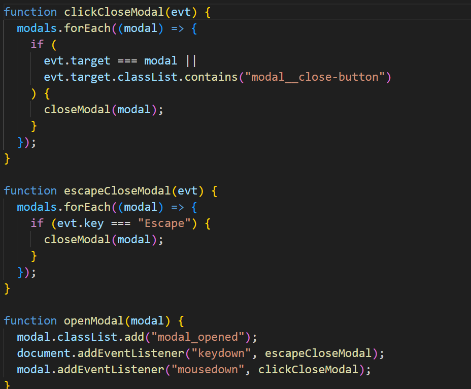

# Project 9: Spots

This is a continued version of project 3, 5 and 6 spots. These older forms of Spots have now been integrated with Wepack, Babel and API's.

## Project features

-API:
-API class creation

-Api call

-Javascript/modals:
-Form Validation

-eventListeners/hardcode refactoring

**GITHUBB PAGE**

[Link to my project on Github](https://samwaxman7.github.io/se_project_spots)

- **Figma**

- [Link to the project on Figma] (https://www.figma.com/design/jFtXsDr4XOyebKcgjyXN6W/Sprint-6-Project%253A-Spots)
