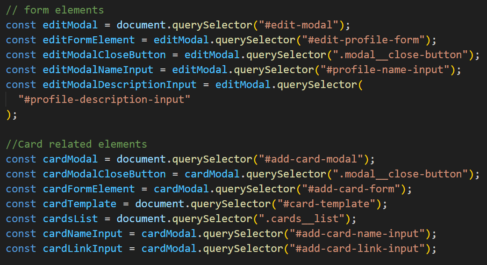
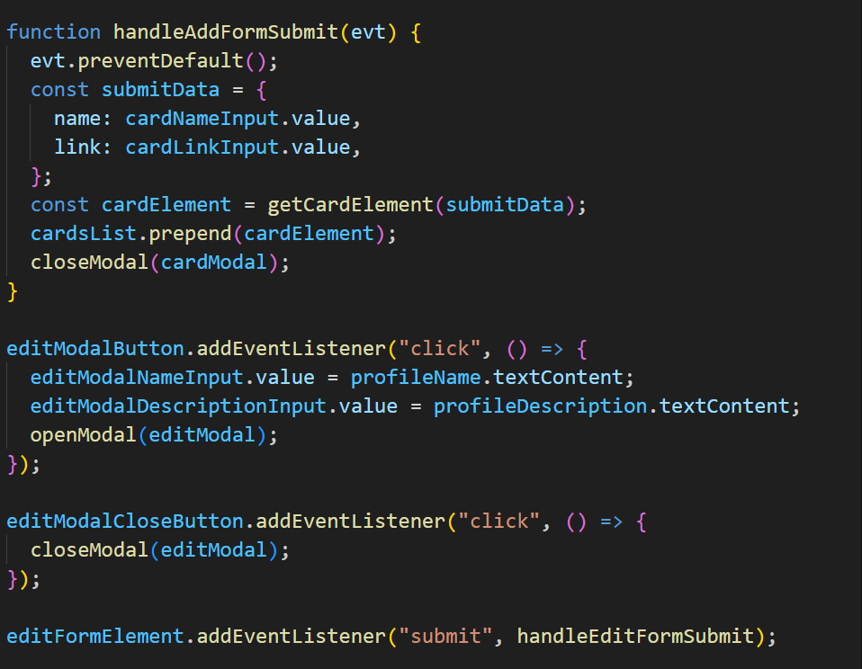

# Project 5: Spots

This is a continued version of project 3 spots. Here I have added responsivness to all of the functions on the webpage using Javascript for the first time. Some functionality that was used in Javscript is the use of variables/arrays and using these to create modals for popups. As well as creating the functionality for buttons both on the website and the popups.

## Project features

-Javascript/modals:
-Form functionality

**GITHUBB PAGE**

[Link to my project on Github](https://samwaxman7.github.io/se_project_spots)

- **Figma**

- [Link to the project on Figma] (https://www.figma.com/design/1qCS9RkiKiVquBhpOJqjZ0/Sprint-5-Project%3A-Spots?node-id=0-1&node-type=canvas&t=oPOiHECqJufxWpUF-0)
