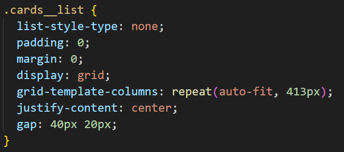
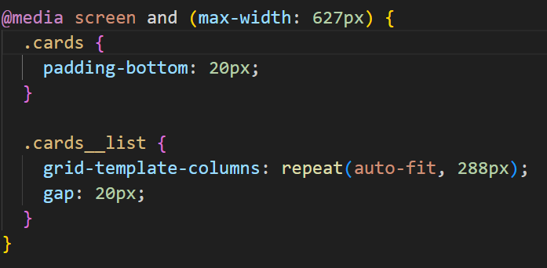
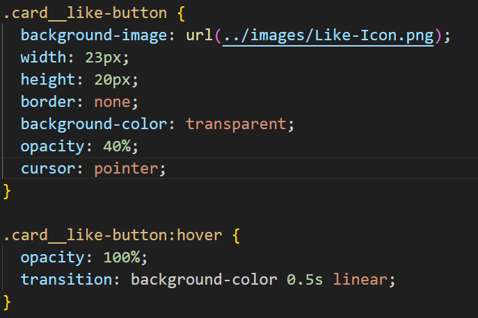

# Project 3: Spots

This is the project spots. It is the first project using figma and creating my own website using the information provided on a figma design. This project is also made to display things correctly on popular screen sizes by using media queries.

## Project features

-grid

-media queries

-buttons
-hover states

**PROJECT ANALYSIS**
https://drive.google.com/file/d/1DpCSNzpBUPBxSYE03JF5MXHe01-9w6H8/view?usp=drive_link

**GITHUBB PAGE**

[Link to my project on Github](https://samwaxman7.github.io/se_project_spots)

- **Figma**

- [Link to the project on Figma](https://www.figma.com/file/BBNm2bC3lj8QQMHlnqRsga/Sprint-3-Project-%E2%80%94-Spots?type=design&node-id=2%3A60&mode=design&t=afgNFybdorZO6cQo-1)
